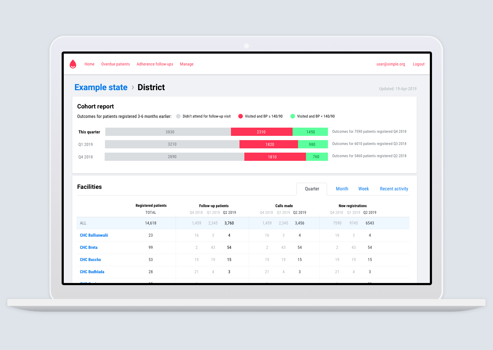

# What is Simple?

[Simple](http://simple.org) has two main components. A mobile app for Android and a web-based secure Dashboard.



The Simple Android app that is used by healthcare workers to:

1. Enroll patients in a hypertension control program
2. Record patients' BPs and BP medicines
3. Contact overdue patients to return them to care
4. Track an individual facility's performance at controlling patients' BPs

Github: [simpledotorg/simple-android](https://github.com/simpledotorg/simple-android) 

👩‍💻 The Android app is primarily written in Kotlin




A web-based tool that allows managers to:

1. Track facility, district, and state-level performance
2. Manager users, facilities, and more
3. Automatically sends text messages to patients to return them to care

Github: [simpledotorg/simple-server](https://github.com/simpledotorg/simple-server) repository

👩‍💻 The dashboard is primarily written in Ruby on Rails and PostgreSQL




## Want to try it out?



