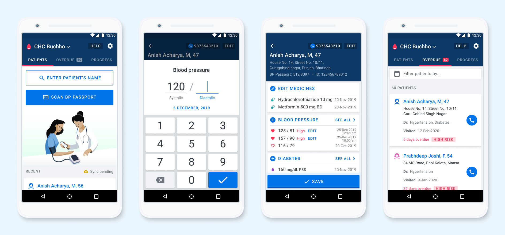

# What is Simple?

This is a truly free, [open source project](https://www.simple.org/license/). [Simple](http://simple.org) has two main components: a mobile app for Android and a secure web-based Dashboard.



The Simple Android app that is used by healthcare workers to:

1. Enroll patients in a hypertension and diabetes control program
2. Record patients' BPs, blood sugars, and current medicines
3. Set future appointments for patients
4. Contact overdue patients to return them to care
5. Track an individual facility's performance at controlling patients' BPs

#### **Technology**

Github: [simpledotorg/simple-android](https://github.com/simpledotorg/simple-android)

The Android app is primarily written in Kotlin



A web-based tool that allows managers to:

1. Track facility, district, and state-level performance in real-time reports
2. Manage users, facilities, and more
3. Overdue patient line lists
4. Deduplicate patients
5. Automatically send text messages to patients to return them to care
6. API to manage data across mobile devices and to integrate with DHIS2 and other applications

.png>)

Github: [simpledotorg/simple-server](https://github.com/simpledotorg/simple-server) repository

👩‍💻 The dashboard is primarily written in Ruby on Rails and PostgreSQL



## One-pager

#### International version

{% embed url="https://drive.google.com/open?authuser=dburka%40resolvetosavelives.org&id=1LzGcSK5nPS0izJT4kV7B3y6syl84ACqo&usp=drive_fs" %}

#### India version

{% embed url="https://drive.google.com/open?authuser=dburka%40resolvetosavelives.org&id=1M2BpHYZALN8UAOaLZUfwFKCRvmq0fI7s&usp=drive_fs" %}

## Want to try it out?


[how-to-test-the-simple-app.md](how-to-test-the-simple-app.md)

