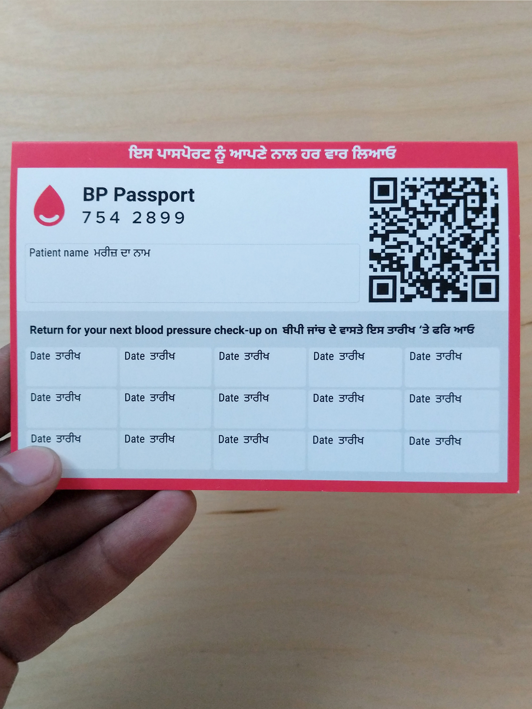
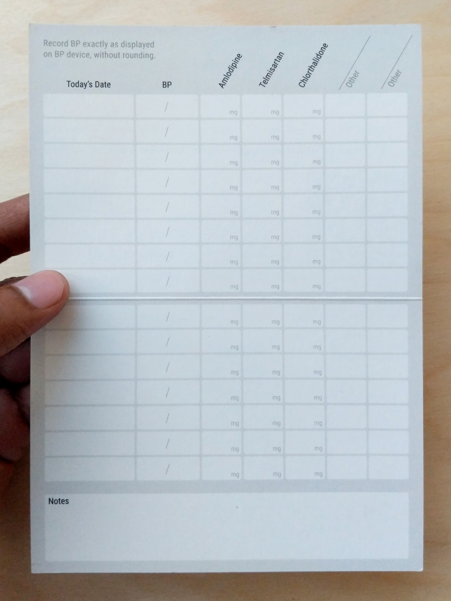
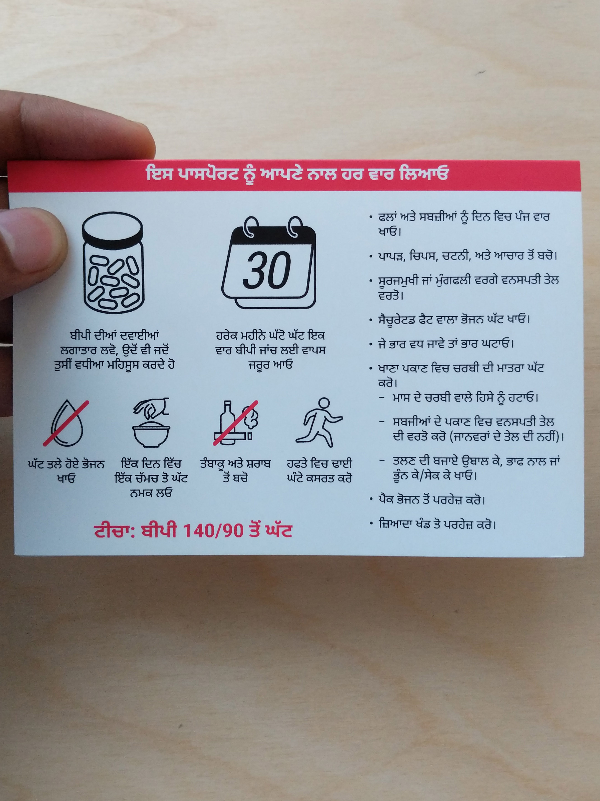
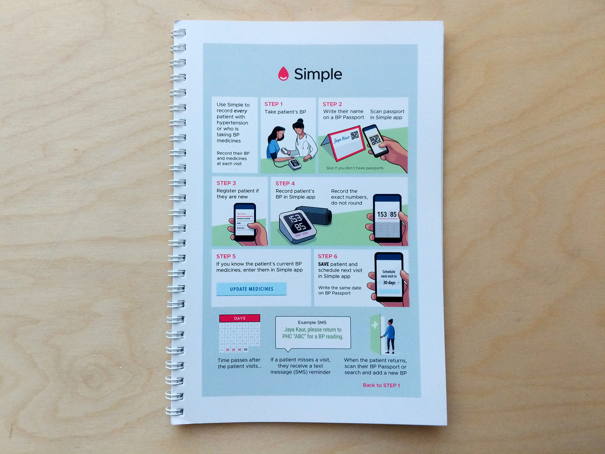
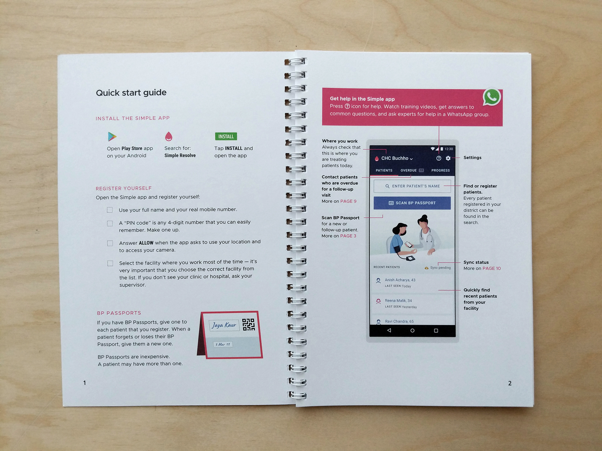

# Design

All of the user interface elements for the Android app and some of the Simple dashboard are now on Figma. Please feel free to 'borrow' or 'steal' anything from our public Figma project. We consider it to be public domain or CC0:  
[**https://www.figma.com/file/kONxBLSXwcQDnV7ya4hIXA/Simple-App**](https://www.figma.com/file/kONxBLSXwcQDnV7ya4hIXA/Simple-App)\*\*\*\*

### Android app

* [Zeplin](https://app.zeplin.io/project/5b9a49113dbe7958c1d3fde6) for a full collection of UI screens
* [Screenshots on our website](https://simple.org/screens) for a curated list of screens with brief explanations
* [UI evolution document](https://docs.google.com/document/d/1z-BCFZ7fpAUvAd55mIiPJBQBLQ9UusU-rrwmvhu0CMg/edit?usp=sharing) to see the iterations that the app has gone through and what we have observed for each of them.

### Web-based Dashboard

* [Zeplin](https://scene.zeplin.io/project/5ce85a735f66941e1fda8d5a) for a collection of some UI screens

### Print materials

* [BP Passports](https://www.dropbox.com/s/k95pspwvh8vikx4/BP%20Passport%20Punjabi%20v10%20%E2%80%94%20Sample.pdf?dl=0) that are given to patients as an ID and a record of recent BPs and medicines     
* [How to take a BP poster](https://www.dropbox.com/s/vwi7k8gvnuf90xy/Blood-Pressure-Measurement-Checklist-007-CC0.pdf?dl=0) \(available in several other languages\)
* [App usage guide booklet](https://www.dropbox.com/s/8buicih4em2qjcg/Simple%20App%20Guide%20v1.2.pdf?dl=0) given to new users   
* **Blood Pressure Checklist**
  * [PDF](https://www.dropbox.com/s/btqawupzl8m581r/Blood-Pressure-Measurement-Checklist-012-CC0.pdf?dl=0) for editing in Adobe Illustrator, Sketch \(979kb\)
  * [Google Slides](https://docs.google.com/presentation/d/1xIZoc5J_ouOHqPZToDq1UIEwyWBO85rjIELM6QO1nes/edit?usp=sharing) ****version
  * [Powerpoint](https://www.dropbox.com/s/mxpxgtkw5l5uq9j/Blood-Pressure-Measurement-Checklist-012-CC0.pptx?dl=0) \(1.6 MB\) 
  * [Affinity Designer](https://www.dropbox.com/s/qdbv9jg6d6fe8r9/BP%20checklist%20illustration.afdesign?dl=0) \(173 KB version 1.7\)

