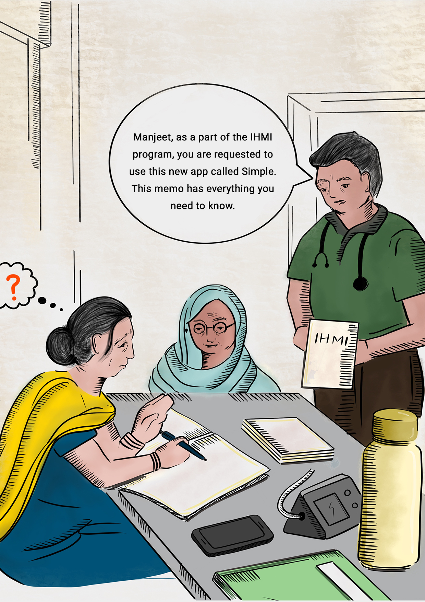
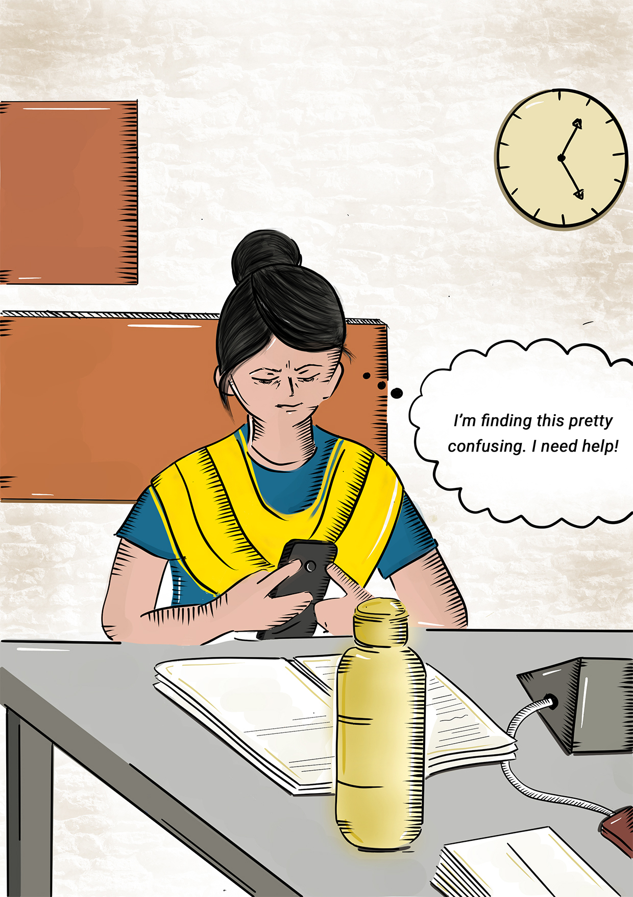
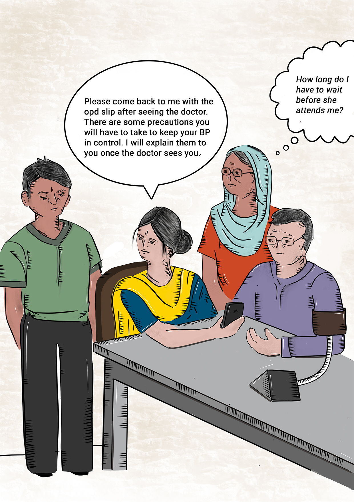
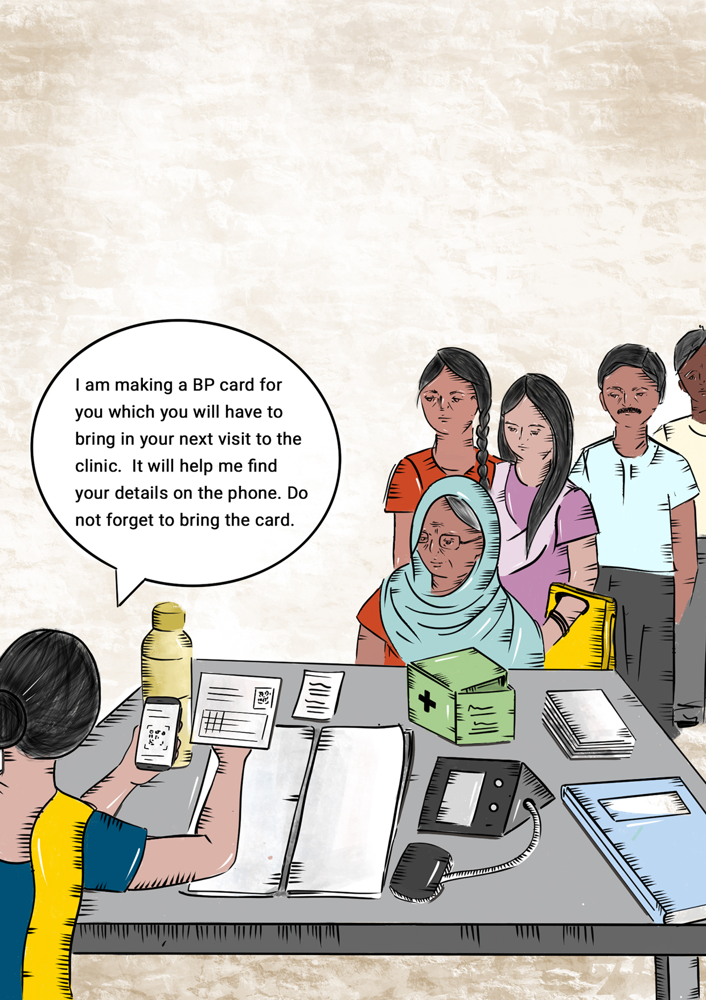
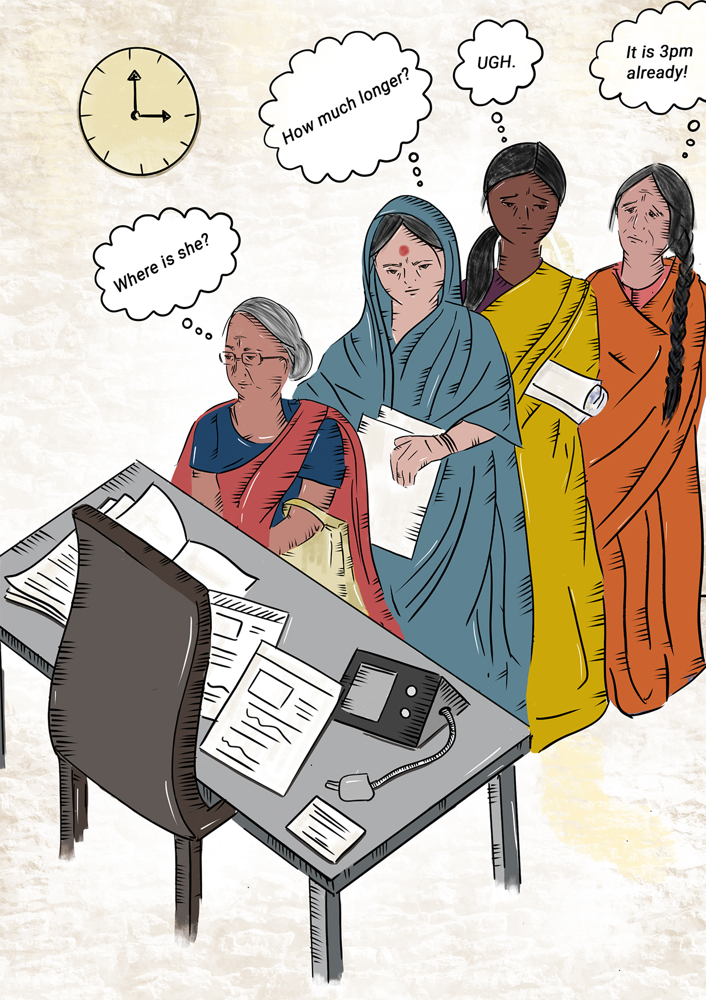
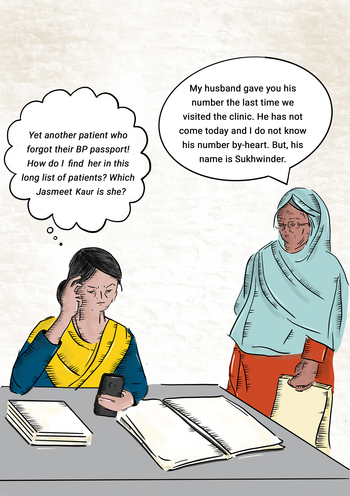
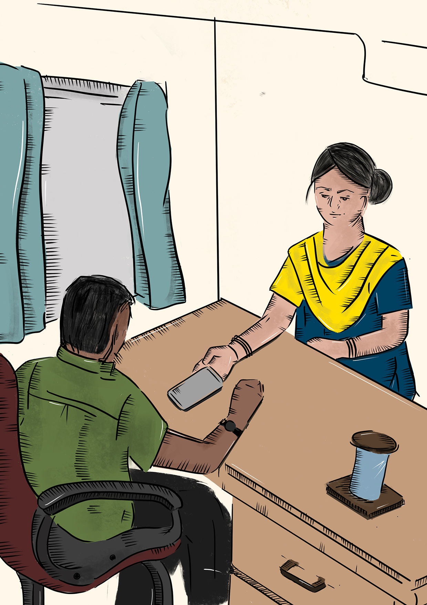
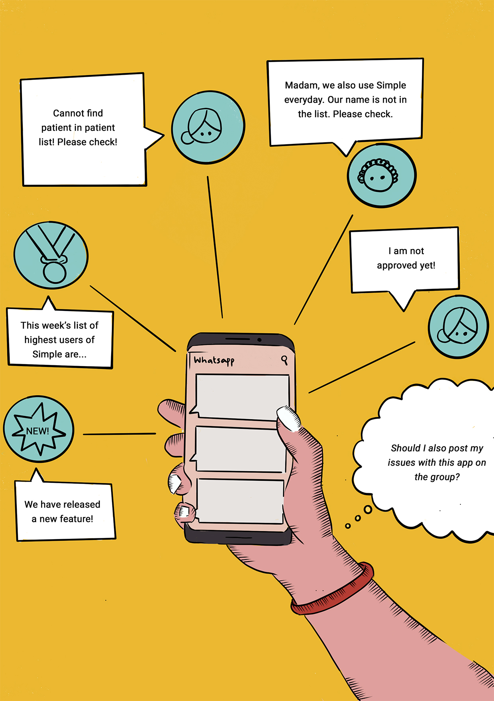
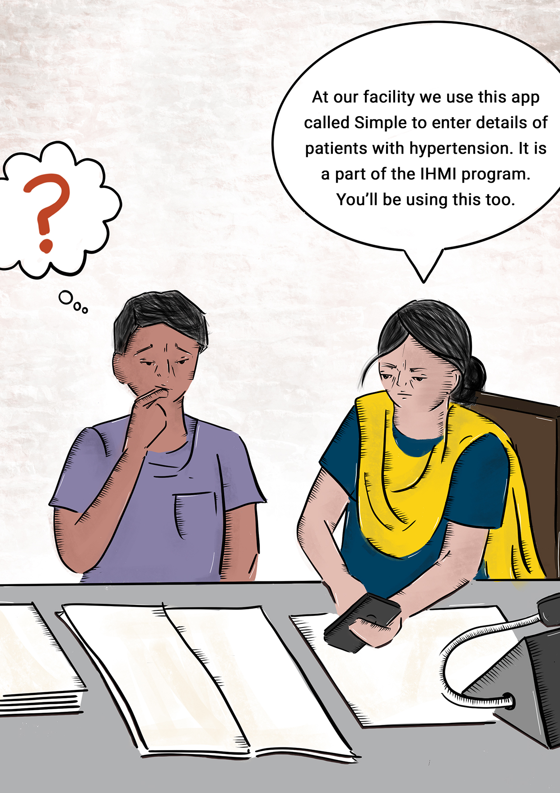

# Key moments in the user journey

Depicted here is the story of Manjeet, a fictional staff nurse at a public PHC \(Primary Health Centre\) in Punjab, India. Manjeet is fairly new to using a smartphone.

After each scenario, are common concerns that we hear from users.

## 1: Manjeet hears about Simple for the first time

_Manjeet’s supervisor hands her a memo about using Simple. She is asked to download it from the Google Play Store and record patients with hypertension on it._

#### **Concerns**

* Is this yet another government program that will not last?
* I have never installed an app… how do I do it?
* Will this be a lot of extra work?
* Will this cost me money?
* How do I learn how to use this app? Will the memo contain instructions?
* I have to learn this new thing now?
* Should I do both paper and app work now?
* I don’t understand English that well. Who will help me?
* I don’t have an Android, what should I do?

## 2: Manjeet's first interaction with Simple

_During her free time, Manjeet downloads Simple. She starts understanding how to use the app._

#### **Concerns** __

* Will this consume a lot of space on my phone?  
* Will I have to delete my personal files for it?
* Will this slow my phone down?
* Will I have to pay for the mobile data?
* Will this eat up my data pack?
* I’m comfortable making entries on a physical register… do I really need to use an app?
* Patient data is critical. What if I make a mistake while entering it?
* This app looks complicated. How long will I take to learn and understand everything?
* What is a PIN? What if I forget the pin? What pin should I enter?

## 3: Manjeet has to juggle several things at once

_A normal day in Manjeet’s life. She handles two or more patients at a time - checking BP, giving instructions, and entering patient data simultaneously. Patients travel back and forth the doctor and nurse’s room before exiting the clinic. Thus, the app is also not used in a linear fashion per patient. Patient data is revisited back and forth as well._

#### **Concerns** 

* I must hurry! The other patients are waiting.
* Will this patient come back to me after seeing the doctor?
* The doctor has asked the patient to come back after 15 days, but I can’t find an option to schedule for 15 days in the app.
* Is it okay if I write down details in the register and enter them in the app later? Manually writing them down is easier.
* Patients think that I am using Facebook at work?!

## 4: Registering a patient for the first time

_Manjeet registers a patient for the first time by filling out a BP passport. She reminds the patient to bring the passport the next time the patient is visiting the clinic._

#### **Concerns**

* I have never used anything like this \(QR code\) before. What does it do?
* Am I doing this right?
* What will happen if patients do not bring these cards?
* I don’t have internet connectivity. Will the patient details be saved?
* My camera is not working. What should I do?
* It is a hassle to write this on a register and record it on the app as well.
* Patient: “Is this nurse playing on her phone or what? What’s happening?”
* What if someone else has recorded this patient’s data previously? How will I get it?
* Why should I enter patient details? It is not my job to do this. Just like the receptionist enters details on the OPD slip, they should do this too.
* This is cool and high-tech!

## 5: Manjeet gets called in for an emergency 

_Manjeet is called for an emergency. She had to stop attending the patients and be present at the ICU._

#### **Concerns**

* I wish someone could fill in for me while I’m at this emergency. My patients are waiting.
* Who will note down patient details in my absence?
* Who will enter data into Simple in my absence?
* Will I have to give my phone to someone else to enter patient data?
* Will I have to enter all the data from paper to app when I go back?
* I am overworked and I don’t even get paid enough!

## 6: Finding a patient through BP passport

_Manjeet looks up a patient using BP passport._

#### **Concerns**

* Scanning is not working because the card is torn. I’m stuck!
* I scanned the card but there is no patient. What do I do?
* The patient brings another family member’s card. What should I say to him?
* The patient brings a card which he lost during his previous visit. He was assigned a new card. He lost the new card and got the old card.  Will it work?

## 7: Reminding patients for their follow-up visits

_During her free time, Manjeet calls overdue patients. She makes a note of the patient’s responses in her notebook._

#### **Concerns**

* Will patients visit on these scheduled dates?
* I have a long list of patients to call. I feel overwhelmed.
* Who are the most important patients to call?
* Why are the patients not taking my calls?
* Will patients call me back at 2 am and interrupt my life?
* What shows on the patient screen? Is it my number? Or does it say Simple?
* I got the wrong number again. Is this even useful?
* Is my balance being used? How do I know?
* What are those beeps when I call the patient?
* Why should I have to call these patients?
* Will the patient’s son inform him/her about this? What should I mark in this case on the app? Should I mark remind me later?
* The list is way too long. I should postpone this work.
* Hard to find a patient from the overdue list. How else to check of a patient has an appointment?
* I had to hear rude comments from patients. 
* When did I last call this patient? How many times have I tried calling them already?
* We don’t have mobile reception in my facility. How do I make these calls?

## 8: Looking up patients through manual search

_A patient, Jasmeet Kaur, forgets to bring her BP passport. Manjeet has to manually search for the patient but finds multiple search results for Jasmeet Kaur. She is frustrated as the patient is old and cannot recall her husband’s phone number._

#### Concerns

* Every second patient who comes here is named Jasmeet Kaur. How do I find her without her phone number?
* Did I enter her spelling wrong?
* Did I miss to register her as a patient the last time? Is that why it is not showing up?
* This is a really long list of patients… can I ever find the right person?
* I remember I entered this patient last week. Now I can’t find them!
* Arwinder had entered this patient yesterday. I am not able to find this patient on my phone.  

## 9: Accessing progress made through progress tab

_During a discussion with her supervisor, Manjeet shows him the progress tab._

#### **Concerns**

* What is he/she going to say?
* Will it affect my work/pay?
* I have great progress. How will I be rewarded? Is it worth it?
* It doesn’t show all my patients. What should I do?

## 10: Manjeet reaches out to Whatsapp support group for help

_Manjeet cannot find a registered patient on the app. She recalls that her supervisor said that she could put her issues on the Whatsapp group of Simple users. She thinks of interacting with people on the Whatsapp support group._

#### Concerns

* Who are the people in this WhatsApp group? I don’t want them to be able to see my number as I post this concern.
* Is my supervisor in this group? How will he react to my complaint? Should I speak to him first instead?
* Is this a silly concern? Should I even post it?
* Is my concern a valid issue? Or is it something that I haven’t learned yet?
* Will everybody judge me?
* Should I post this question in English?
* “This week’s list of highest users of Simple is” - makes me feel overwhelmed. Is this a competition?
* I have a small facility. How can I be a part of the “highest user” reward?
* I am a woman, I can’t share my phone number publicly.

## 1**1: Manjeet hands over Simple to the next nurse**

_Manjeet is transferred to another clinic. Her supervisor asks her to brief the nurse who will be replacing her with all the roles and responsibilities. Manjeet introduces the new nurse to Simple._

#### Concerns

* I learned this by myself. No one helped me. Why should I do this now?
* Will he understand it easily?
* What if he asks me questions which I don’t know answers to?
* This is not part of my job. Why should I do it?
* What if I teach him something wrong?
* I know there are training documents… can I get more for my trainee?


This document was inspired by the wonderful work of the Airbnb design team on their "Snow White" project. [Read about the project...](https://www.inc.com/yazin-akkawi/the-surprising-technique-airbnb-uses-to-better-sell-an-experience.html)


