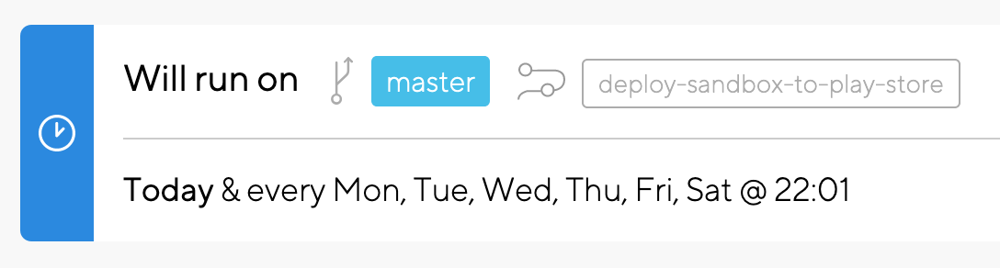
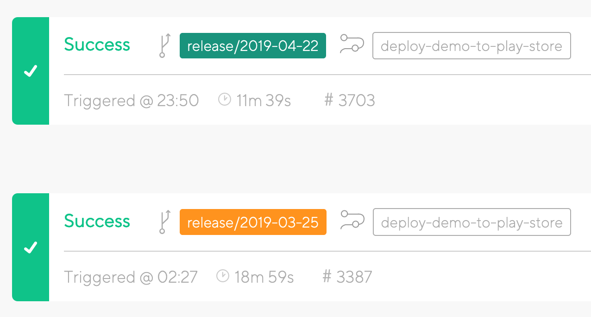

# Deploying to Play Store

## Sandbox app

* The Sandbox app is automatically deployed to the Play Store, every night at 10pm.
* We do this using Bitrise.io, the CI service. 
* There is a "Scheduled Build" that runs every night at 10pm, which runs the `deploy-sandbox-to-play-store` workflow on the `master` branch.
* No other manual intervention is required.



## Demo & Production app

Our releases happens at regular intervals. For now, this interval is one \(sometimes two\) week, and Monday is release day.

Our integration branch is `master`: this is where PRs are merged, and release branches are made from. All release branches have a one-week holding period, during which we manually verify the app \(using [Simple Demo](https://play.google.com/store/apps/details?id=org.simple.clinic.staging)\) before it goes live on the [production app](https://play.google.com/store/apps/details?id=org.simple.clinic).

### Step 1: Prepare release, and push to Demo on Play Store



1. On release day \(currently Monday\), a branch is cut from `master` named [in a specific format](conventions.md#release-branches).
2. The CHANGELOG.md file must be updated on this release branch: rename the "Next release" section to "On Demo" to denote that the changes of that section are live on the Demo app.
3. The CHANGELOG.md file must also be updated [on master](https://github.com/simpledotorg/simple-android/blob/master/CHANGELOG.md) itself. This keeps the entire team informed about which changes are already present on Demo.
4. Push the newly created release branch to the repository. This will automatically trigger Bitrise to run the unit and integration tests build. 
   1. _Wait for this build to finish before you move to the next step!_
5. The Demo app is built from this branch and released to [Simple Demo](https://play.google.com/store/apps/details?id=org.simple.clinic.staging) on the Play Store. There is a workflow on Bitrise to do this: `deploy-demo-to-play-store`. Run this workflow on the newly created release branch -- everything else happens automatically. 
   1. _If you run the deploy workflow before the tests build finishes, you will never know if something is broken in the release build._
6. Post the details of this release to the `#releases` Slack channel to inform the rest of the organisation.
   1. Use the [appropriate emoji](../publishing-release-notes/#release-emojis). Include the CHANGELOG section for this release.
   2. Inform the UI test engineer\(s\) to run all UI \(Appium\) tests on this build.
   3. Link the Bitrise build that ran the unit and integration tests; it also generates an APK pointing to the QA server that the UI test engineer\(s\) use to run Appium tests.

> 🏇 Release for 17th December is now on Simple Demo on Play Store.
>
> * Nudge users to update the app if it is older than expected
>
> [https://app.bitrise.io/build/91f965ad0a87ad08\#?tab=artifacts](https://app.bitrise.io/build/91f965ad0a87ad08#?tab=artifacts)

### Step 2: Fix issues, if any

* If someone discovers a problem in the Demo release, it must be fixed and merged into `master`, and then cherry-picked into the release branch.
* Only a few categories of issues are eligible for cherry-picking: bug fixes and language/text changes. All other types of issues will have to wait till the next release goes out.
* Whenever a commit is cherry-picked from `master` onto the release branch, it should be done with the `-x` flag to record the SHA1 hash of the original commit on `master`.

```bash
 $ git cherry-pick -x a986fb4
 $ git show 

 commit 5eaf72b8ee1865595df49ecfea20115b8454f639
 Author: Ajay Kumar <not@obvious.in>
 Date:   Fri Mar 22 19:42:07 2019 +0530

 Show keyboard automatically when update phone dialog is shown

 (cherry picked from commit a986fb4)
```

* Push the updated release branch, and let Bitrise finish running all the tests.
* If all tests pass, the deploy the updated release branch to Demo again, using the same `deploy-demo-to-play-store` workflow.

### Step 3: Deploy to "production" on Play Store

* The branch that has been on Demo since the last release day is assumed to be ready for publishing to Production.
* Bitrise has a workflow for this: `deploy-prod-to-play-store`. 
  * A build is triggered on the release branch, using this workflow 
  * This will create and push the release APK to the Play Console for the [Production app](https://play.google.com/store/apps/details?id=org.simple.clinic)
* The release must be created on the [Google Play Console](https://play.google.com/apps/publish) manually.
  * Go to the _Simple \(org.simple.clinic\)_ listing on the Console
  * Open _Release Management_, and then _App Releases_
  * Click on _Manage_ on the "Production Track"
  * Click on _Create Release_ to create a new release draft
  * Click on _Add From Library_, which will open the APK Library, where you will find the APK that Bitrise has just created and pushed
  * Copy only the fixes and features \(exclude internal changes\) from release notes from the CHANGELOG.md file
  * Publish the release to 25% of users on Monday
  * If everything goes alright, release to 100% of users on Thursday
  * Post the details of this release to the `#releases` Slack channel to inform the rest of the organisation
* Finally, on the `master` branch, the "Demo release" section in [CHANGELOG.md](https://github.com/simpledotorg/simple-android/blob/master/CHANGELOG.md) must be updated with the version name of the APK on the Play Store.

