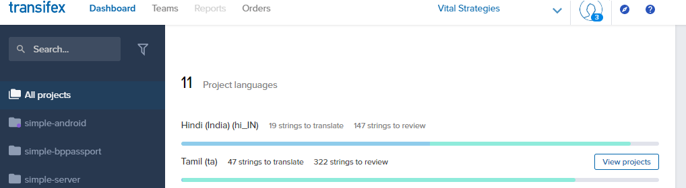
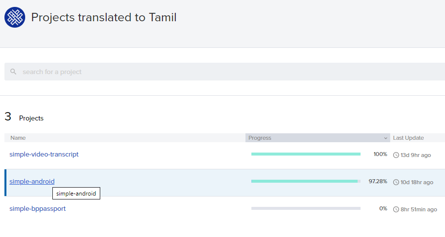
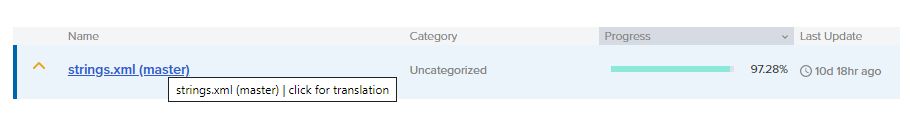
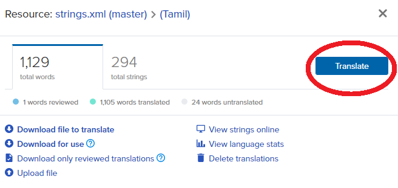
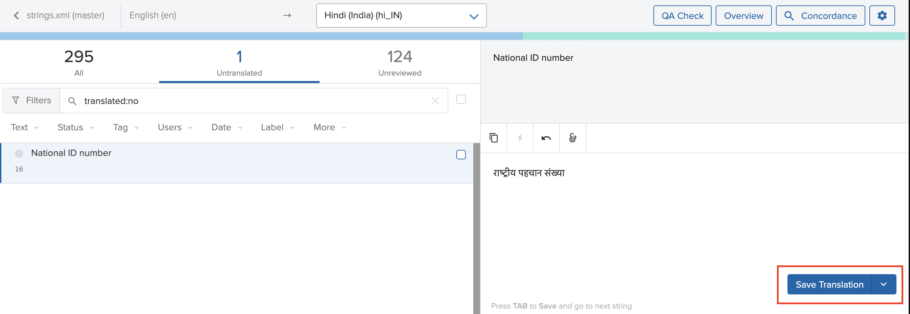

# Adding/Editing translations for a project

* Login to the [Transifex](https://www.transifex.com/) platform.
* Once logged in, on the **Dashboard tab**, with All projects selected on the left navigation bar.

* Hover over the language that you would like to translate under project languages, and click on the View projects button that appears.
* The list of projects that are available for translation in that language appears.

* Click on the project that you would like to translate.
* The list of files in that project that need to be translated appears. The files will be named slightly differently based on the type of project, but the translation process will not change.
* Click on any of the files.

* In the pop-up that opens, click on the **Translate** button.

* A list of all strings and their translations \(where available\) are displayed

* Click on the string that needs translating and translate it. After the translation is done, click on the blue **Save Translation** button.

