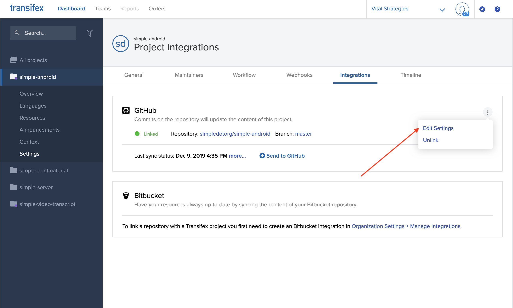
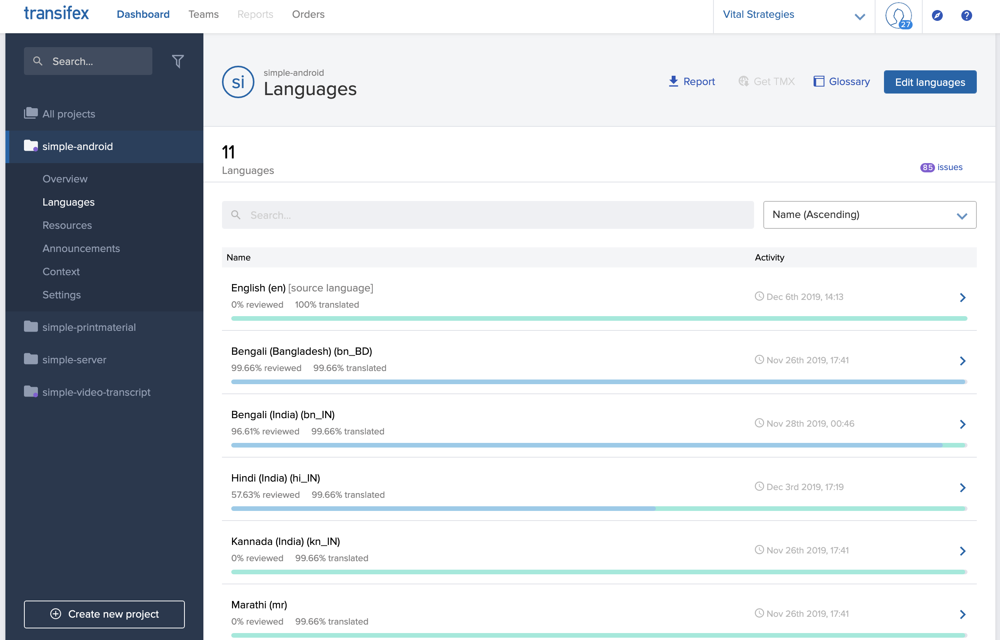
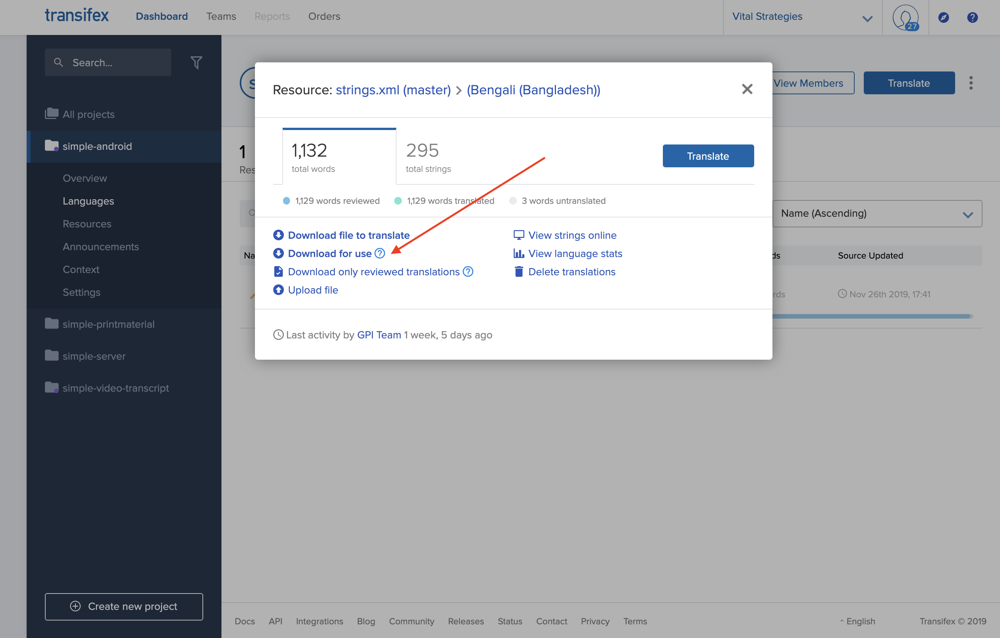

# Android

## GitHub Integration

The Simple Android app is connected to Transifex via the [GitHub Integration](https://docs.transifex.com/transifex-github-integrations/github-tx-ui). What this enables us to do is:

* Define a source locale \(default: `en`\) which Transifex will automatically read whenever changes are pushed to a specific branch on the project \(currently `master`\).
* Whenever translations for a specific locale are done, Transifex will automatically raise a pull request, which a maintainer can merge \(See [\#965](https://github.com/simpledotorg/simple-android/pull/965) for an example\).

### Settings

The Transifex GitHub integration settings can be found on the project settings page under the **Integrations** section.



Clicking on **Edit Settings** opens a page with multiple sections. The sections and their configuration are described at [this LINK](https://docs.transifex.com/transifex-github-integrations/github-tx-ui#linking-a-specific-project-with-a-github-repository).

### Language mappings

In the GitHub integration settings, there is a language mapping section that tells Transifex how to convert from the locale conventions that it uses to the locale conventions that the Android app uses. This will be used by Transifex when raising pull requests to merge new translations into the app.

The current mapping \(at the time this article was written\) looks something like this:

```yaml
hi_IN: hi-rIN
bn_IN: bn-rIN
bn_BD: bn-rBD
pa: pa-rIN
ta_IN: ta-rIN
te_IN: te-rIN
kn_IN: kn-rIN
mr: mr-rIN
om: om-rET
ti: ti-rET
```

On the left are locale codes in the Transifex convention, while on the right are the locales in the convention that the Android app expects. Whenever a new language is added to the app, this mapping table also needs to be updated.

### Manually pulling strings from Transifex

The Transifex integration has currently been setup to automatically raise pull requests whenever a language is 100% translated. Sometimes, however, we might need to pull partially translated languages manually and put them in the app. Transifex supports this use case as well.

#### Process

* Login to the [Transifex](https://www.transifex.com/) platform.
* Once logged in, on the **Dashboard tab**, with All projects selected on the left navigation bar.



* Click on the **simple-android** project, and then click on **Languages** in the sidebar.
* The list of languages appears. Click on the language you manually want to download translations for.
* The list of source files in that language appears. Currently, the Android app has only one source file, `strings.xml`. Click on it, and the following view opens. Click on **Download for use** to download an Android string resource file that can be dropped into the project.



* The name of the file does not match the Android conventions when downloaded manually. You should rename the file to `strings.xml` to match the conventions.
* Place the strings into the appropriate resource directly and raise a pull request with the new strings.

### Notes

Regardless of whether the string resources are raised automatically via Transifex, or manually added, a new language does not automatically show up in the list of languages the user can select via the Settings screen. In order to add a new language to the screen, add an entry to the `SettingsModule` class \([LINK](https://github.com/simpledotorg/simple-android/blob/master/app/src/main/java/org/simple/clinic/settings/SettingsModule.kt)\).

