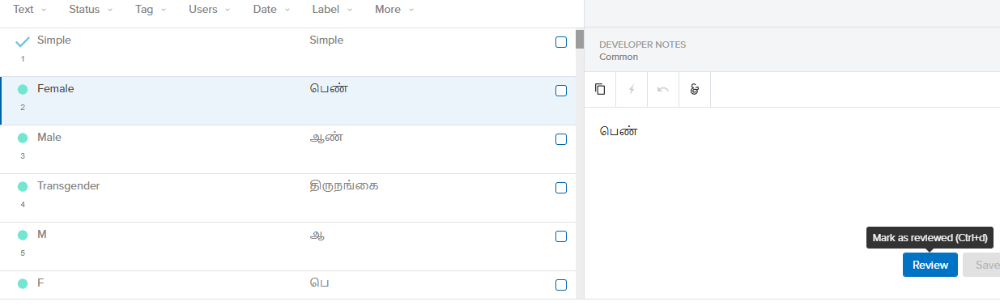
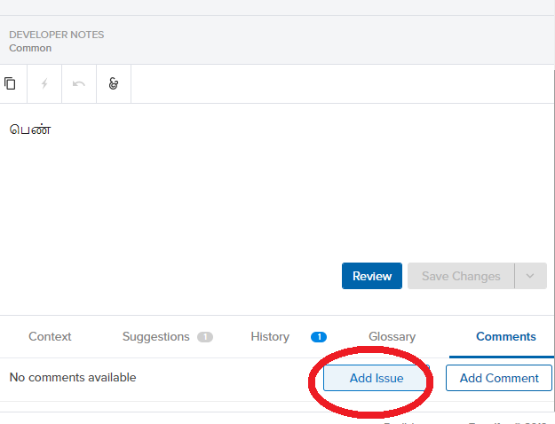
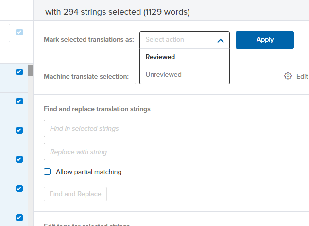

# Reviewing a translation

* Login to the [Transifex](https://www.transifex.com/) platform.
* Once logged in, on the **Dashboard tab**, with All projects selected on the left navigation bar.

* Hover over the language that you would like to translate under project languages, and click on the View projects button that appears.
* The list of projects that are available for translation in that language appears.

* Click on the project that you would like to translate.
* The list of files in that project that need to be translated appears. The files will be named slightly differently based on the type of project, but the translation process will not change.
* Click on any of the files.

* In the pop-up that opens, click on the **Translate** button.

* A list of all strings and their translations \(where available\) are displayed

* You can also look at all the strings that have not yet been reviewed by clicking on the **Unreviewed** section on the top right

* If a string does not have a translation, please ignore and move on to the next one. It will be translated in the future. 
* If the translation you see is correct, click on the blue **Review** button at the bottom of the text box on the right.

* If not, scroll down in the window on the right, and click on **Comments** &gt; **Add Issue** below the Review button, and then add the proposed edit. Do **NOT** click “Add Comment”

* If there are no suggestions,  you can review all the strings and then use the Select all checkbox to mark all the strings are reviewed.

