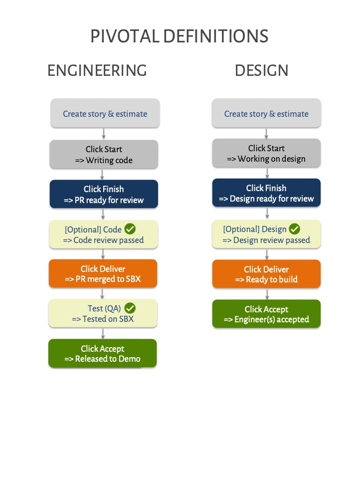

# Pivotal Tracker \(Guide\)

## Pivotal Tracker project board

🎯  [https://www.pivotaltracker.com/n/projects/2184102](https://www.pivotaltracker.com/n/projects/2184102#)

## Definitions

**Epic:** Epics capture high level goals associated with a feature

**Feature/Story:** An epic are broken down into concrete, independent units called stories. Stories are typically estimated \(1 = low complexity, 2 = medium complexity, 3 = high complexity\) before started

**Chore:** A purely technical task that does not add demonstrable value to any user of the system

**Bug:** A feature in production but does not function as expected

**Icebox:** The Icebox contains a list of all features/stories, chores and bugs

**Backlog:** The Backlog represents a prioritised list of stories planned to be worked on in the upcoming weeks

**Current Iteration:** The Current Iteration represents a prioritized list of stories to be worked on during the current iteration \(1 week\)

**Blocker:** A question \(relating to a story\) that needs to be answered before that story can be worked on. A dependency where another story needs to be completed before a story can be worked on.

**Release:** A release marker in the backlog represents one version of that milestone to be delivered

## Status of cards and corresponding definitions

## **Steps we use**

**`Start`**

* Click on "Start" when you start working on a story.
* \[Design\] Click on "Start" when you start working on the design for a story

**`Finish`**

* Click on "Finish" when you have finished working on the story \(code complete + unit tests passed\).
* This indicates that the story is "waiting for PR review"
* \[Design\] Click on "Finish" when you have completed the design for a story

**`Deliver`**

* Click on "Deliver" when the PR is reviewed and merged to sandbox
* \[Design\] Click on "Deliver" when the designs have been reviewed

**`Test (QA)`**

* Click on "add review", select Test \(QA\) and add a reviewer
* Select "Pass" if QA passed
* Select "Revise" if QA failed
* \[Design\] Click on "Deliver" when the designs have been reviewed

**`Accept`**

* Click on "Accept" if the story is seen on demo and the behaviour is as expected
* \[Design\] Engineer to click on "Accept" when the designs can be implemented

**`Reject`**

* Click on "Reject" if QA failed on the demo app
* Explain why QA failed
* This needs to be fixed and QA'd before it is ready to be pushed to prod
* \[Design\] Engineer to click on "Reject" if the design cannot be implemented; explain why

**`Restart`**

* Story was "Reject"ed on QA
* You can "Restart" the story and go through the Finish &gt; Deliver &gt; Accept / Reject cycle once again
* \[Design\] Click on "Restart" when you start working on the design for a story, go through the Finish &gt; Deliver &gt; Accept/Reject cycle once again

