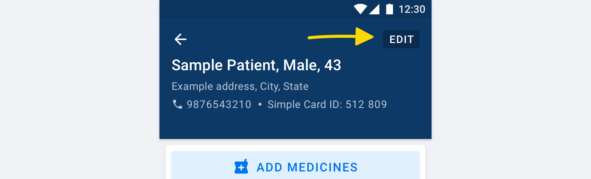
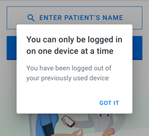

# Guide for use in the field

<table>
  <thead>
    <tr>
      <th style="text-align:left">Guidelines</th>
      <th style="text-align:left"></th>
    </tr>
  </thead>
  <tbody>
    <tr>
      <td style="text-align:left">
        
<b>Support</b>
        

        

          
        

      </td>
      <td style="text-align:left">
        
It is important to stay active on your WhatsApp groups and help healthcare
          workers when they face an issue with Simple. Thank you for your hard work
          and cooperation.

        

      </td>
    </tr>
    <tr>
      <td style="text-align:left">
        
<b>Be kind</b>
        

        

          
        

      </td>
      <td style="text-align:left">Ask the users to not get worried when they have made any mistakes or if
        they&#x2019;re confused. We are here to help them.</td>
    </tr>
    <tr>
      <td style="text-align:left">
        
<b>Location access</b>
        

        

          
        

      </td>
      <td style="text-align:left">Ask users to allow access to their location during sign-up. This will
        help them find the correct facility and prevent registration of patients
        under the wrong facility.</td>
    </tr>
    <tr>
      <td style="text-align:left">
        
<b>Ideas</b>
        

        

          
        

      </td>
      <td style="text-align:left">When users request new features or have ideas to improve Simple, please
        make a note and message to Praveen.</td>
    </tr>
  </tbody>
</table>> **If the issue doesn’t get resolved with any of the suggested workarounds, kindly make a note of it and report the issue along with the details to Praveen.**

## **Issues**

### **1. "I am not able to find a patient"**

* Try searching with a different spelling, e.g 'Aakash' instead of 'Akash'
* Make sure to match patient details - \(full name, age, address, last visit date\) to check if patient is already registered. 
* Enter full name \(First name + last name\) for e.g type 'Parminder Kaur Ahluwalia'
* Ask the patient if they have already been registered at the same or different facility.

### 2. "I have duplicate patients"

* Inform the users that we are working on a solution to remove duplicates from the system.

### 3. "I recorded a patient at the wrong facility"

* Make sure that the users have currently selected correct facility from the home screen of the app.
* Make a note of the patient that is recorded at the wrong facility and report it to Praveen.

### 4. "I want to edit patient details"

* Ask the users to tap on the 'EDIT' button on the top right corner of the patient details screen.

### 5. "My call gets disconnected when I call a patient"

* Ensure that the phone number they are trying to call is correct \(has correct number of digits\)
* Ask the users to wait patiently while the call is being connected.
* Inform the users that they will hear a funny beeping noise \( when the call is being connected\) which is completely normal. They should not hang up.

### 6. "Will I be charged for the calls made to the patients"?

* There are two ways to call a patient. Secure calls are free and the user’s phone number is hidden.
* Normal calls are charged as per user's network provider.

### 7. "I am not able to see recent patients"

* If the users have recently downloaded the app, then they must be approved in order to be able to see recent patients.
* If there are no patients recorded in the facility, they will not be able to see them.
* Ask the users to tap on the cloud icon on the home screen to refresh the recent patients list.
* Ensure that their phone is connected to internet.
* The first time when the app syncs data, it can take some time.

### 8. "My data is not syncing"

* Ensure that the user’s phone is connected to the internet.
* If the user is trying to access patient data on another device, then they need to wait for a few minutes for the sync to finish.

### 9. "I am not able to download the app"

* Type ‘**simple resolve**’ on Google Play Store to download the app.
* User must be using any modern Android phone or tablet, version 5 or above.  Ask them to check their Android phone version- Go to Settings -&gt;scroll all the way down , they will see - ‘About Phone’. Tap on it to check the phone version.

### 10. "What is the meaning of patient at high risk"

* Patients who are overdue by more than **30 days** and had their last BP **greater than 160/100** or has previously had a heart attack / stroke, or is suffering from diabetes or kidney disease are critical and at high risk of stroke. They must be called for check-up.

### 11. "For what values of BP is the patient considered 'hypertensive'?

* When the patient's  $$BP >= 140/90$$ 

### 12. "How can I remove the prescribed medicines"

* Inform the users that patients must not stop taking hypertension medicines.
* If they wish to change the medicines, then ask them to tap on the medicine name and select 'NONE' to remove it.
* Select a different medicine \(prescribed by the doctor\), select dosage and tap on 'SAVE'.

### 13. "Our BP Passports are over, how to request for new passports ?"

* Ask the users to ensure they have 2 boxes of BP passport in reserve at all times.
* In case they do not have BP passports, they can still continue to register & update patient BP's using 'SEARCH'.
* **Call Praveen** to place a new request for BP passports.
* It takes about a month for the passports to arrive after placing a request.

### 14. "Should I issue a new BP passport to old patients as well ?"

* Yes, ask the users to issue BP passport to all hypertensive patients and discontinue the old IHMI cards.

### 15. "**I want to change my handset, but continue to use Simple with same mobile number. How can I do it ?"**

* Download the ‘Simple’ app on the new handset from Google Play store.
* Ensure that user's new handset has the same sim card as their registered mobile number with ‘Simple’.
* Ask them to open the ‘Simple’ app & tap on ‘Get started’**.**
* They need to enter their mobile number & then their 4-digit security PIN
* After successfully entering the correct PIN, they will see the following message:

### 

* Ask them to tap on ‘GOT IT’ and they can start using Simple as they normally do.
* They will be logged out of their old device.

### 16. "**Can I use the same mobile number in two handsets to use the simple app ?"**

* No, users cannot use two handsets to use Simple.
* Users can only be logged in on one device at a time.

### 17. "**I selected the wrong facility during installation and registration process in the Simple app. What should I do ?"**

* The CVHO is requested to immediately get in touch with Praveen and share user's details to get the facility corrected.

### 18. "**I am transferred to another facility, how can I get it changed ?"**

* Users can change it in the app themselves. Tap on the icon next to current facility name on the home screen , and select another facility.
* If users are not able find the facility name , then their CVHO is requested to immediately get in touch with Praveen and share user's details to get the facility changed.

### 19. "**If a patient is already registered in one facility and visits another facility, should he/she be registered as a new patient again ?"**

* If the patient is already registered in another facility, he/she **must not be registered again in the new facility.**
* However, their details like - blood pressure, medicines etc. can be updated normally.

