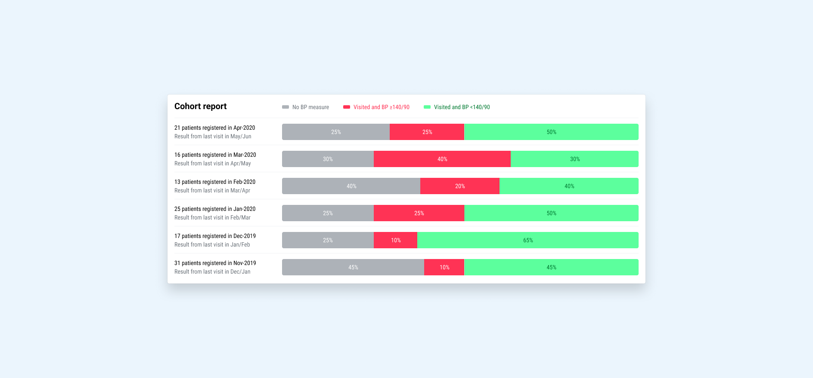

# What we report

To improve hypertension and diabetes treatment for a clinic or even an entire population, you have to understand how the system is performing. You need to see if patients are getting healthy, if they're being treated, if they're coming back for follow-up visits, and if they're being registered into the system.

Simple collects the bare minimum of information necessary to identify a patient, treat the patient for hypertension and diabetes, and schedule a follow-up. We aggregate this information at multiple region levels. Each country has 5 regions and each country has unique region names:\

| Country         | Region 1     | Region 2 | Region 3 | Region 4 | Region 5 |
| --------------- | ------------ | -------- | -------- | -------- | -------- |
| 🇮🇳 India      | Organization | State    | District | Block    | Facility |
| 🇧🇩 Bangladesh | Organization | Division | District | Upazila  | Facility |
| 🇪🇹 Ethiopia   | Organization | Region   | Zone     | Woreda   | Facility |

## Registrations

**Monthly registered patients:** the number of patients registered at a facility during a month where the patient (1) is not deleted and (2) is hypertensive.

**Total registered patients:** the number of patients registered at a facility. _Note: this is calculated by adding monthly registered patients at a facility over time_

**Why is this important?** Program managers monitor registration numbers to ensure healthcare workers are registering patients into the system.

## Total assigned patients

The number of patients a facility is responsible to control their hypertension where a patient (1) is not deleted (2) is hypertensive and (3) is not dead

**Why is this important?** This indicator represents the number of patients a facility is responsible for. It is the population base used to calculate indicators like BP controlled and Missed visits.

## BP controlled

The number of patients assigned to a facility registered before the last 3 months where the patient (1) is not deleted (2) is hypertensive (3) is not dead (4) has a BP measure taken within the last 3 months and (5) their last BP measure taken is <140/90.

**Why are patients registered within the last 3 months excluded?** Three months gives patients time to take their hypertension medication. Newly registered patients have uncontrolled blood pressure, and including them would not reflect an accurate picture of actual controlled patients.

**Why is this important?** This indicator reflects the overall health of a hypertension control program and is the most important indicator our system tracks.

## BP not controlled

The number of patients assigned to a facility, registered before the last 3 months where the patient (1) is not deleted (2) is hypertensive (3) is not dead (4) has a BP measure taken within the last 3 months and (5) the last BP measure taken is ≥140/90

_Note: We display this key indicator as a rate where the denominator is total assigned patients registered before the last 3 months._

**Why is this important?** It shows which patients are coming back to care, but require continued hypertension treatment to control their blood pressure.

## Visited but no BP taken

The number of patients assigned to a facility, registered before the last 3 months where the patient (1) is not deleted (2) is hypertensive (3) is not dead (4) has at least one of the following in the last 3 months: an appointment created, a drug refilled, a blood sugar taken and (4) doesn't have any BPs recorded within the last 3 months.

_Note: We display this key indicator as a rate where the denominator is total assigned patients registered before the last 3 months._

**Why is this important?** We started tracking this indicator during COVID-19, because patients were visiting facilities to pick up medications but didn't have their BP taken to avoid contact with healthcare workers and prevent COVID infection. This is not very common, but helps capture the entire patient base.

## Missed visits

The number of patients assigned to a facility, registered before the last 3 months where the patient (1) is not deleted (2) is hypertensive (3) is not dead and (4) doesn't have a visit or BP recorded within the last 3 months.

_Note: The SQL query is a combination of all the queries in the equation above_

_Note: We display this key indicator as a rate where the denominator is total assigned patients registered before the last 3 months._

**Why is this important?** This number reflects how good facilities are at reminding patients to come back to care in the 3-month period we're tracking controlled and uncontrolled patients.

## Lost to follow-up

The number of patients assigned to a facility where the patient (1) didn't have a BP recorded within the last year (2) was registered more than a year ago (3) is hypertensive (4) is not dead and (5) is not deleted.

_Note: We display this key indicator as a rate where the denominator is total assigned patients._

**Why is this important?** The main key indicators exclude lost to follow-up patients to allow program managers to assess the health of patients that are coming back to care.

## Patients under care

The number of patients assigned to a facility where the patient (1) had a BP recorded within the last year (2) is hypertensive (3) is not dead and (4) is not deleted.

**Why is this important?** Represents the number of "active" patients or the number of patients that aren't lost to follow-up.

## Follow-up patients

**Follow-up patients per user:** For a given period, the number of patients attended by a user where the patient (1) is hypertensive (2) is not deleted (3) was registered before that period and (4) had a BP taken, a blood sugar taken, an appointment scheduled, or their medications updated during that period by that user.

**Follow-up patients per facility:** For a given period, the number of patients that visited a facility where the patient (1) is hypertensive (2) is not deleted (3) was registered before that period and (4) had a BP taken, a blood sugar taken, an appointment scheduled, or their medications updated during that period at that facility.

**Follow-up patients per region:** For a given period, the sum of follow-up patients across all facilities in the region.

**Why is this important?** This indicator is an indicator used to monitor the facility's activity. Follow-up patients are often compared with total assigned patients because it shows what proportion of patients are getting treated.

## Total facilities

Facilities registered in Simple where the current user can view reports.

**Why is this important?** This allows program managers to see all the facilities they are responsible for.

## Inactive facilities

Facilities registered in Simple where the current user can view reports and where <10 patients had a BP recorded in the last 7 days.

**How it's calculated:** First we calculate total active facilities (Facilities where >10 patients had any BPs recorded in the last 7 days). Then we (1) grab all facilities the admin has access to (2) count the total number of patients with a BP taken in a day for the last 7 days at each facility and (3) return the number of facilities where the facility has had more than 10 patients with a BP taken in the last week.

**Why is this important?** This indicator allows program managers to see which facilities may be facing technical issues with the system or healthcare workers that are forgetting to record BP measures into the system.

## Patients with BP measure taken

Number of unique patients with a BP measure taken in a given number of days. If a patient has multiple BPs in one day, they are only counted once.

**Why is this important?** This indicator allows program managers to quickly see if a facility is actively taking BP measurements.

## BP measure taken

Counts all blood pressures recorded by each healthcare worker at a facility where the patient (1) is hypertensive and (2) is not deleted.

**Why is this important?** Similar to inactive facilities, this allows program managers to see which facilities are facing technical issues or facilities with healthcare workers that aren't recording BP measures into the system.

## BP log

All blood pressures recorded at a facility.

**Why is this important?** This allows program managers to see if healthcare workers are inputting accurate BP readings into the system. There are cases when healthcare workers round systolic and diastolic numbers, and it's really important for them to enter the exact reading, otherwise the higher-level indicators will be inaccurate.

## Cohort reports

Hypertension control takes time, and cohorts allow us to track a set of patients receiving treatment over time. We take all the patients registered in a given period of time and look to see if they returned for care during a subsequent period of time. If they returned to care, we look to see if their blood pressure was under control.

We use monthly cohorts to quickly track performance, and quarterly cohorts to determine systematic improvements over longer timeframes.

The calculations for monthly and quarterly cohorts are the same. The only difference is in the registration period (month versus quarter).

### Monthly cohort reports

**BP controlled numerator:** The number of patients assigned to a facility registered during a month where the patient (1) is hypertensive (2) is not deleted (3) is not dead (4) has a last BP in the following 2 months and (5) the last BP is <140/90.

**BP not controlled numerator:** The number of patients assigned to a facility registered during a month where the patient (1) is hypertensive (2) is not deleted (3) is not dead (4) has a last BP in the following 2 months and (5) the last BP is ≥140/90.

**No BP taken numerator:** The number of patients assigned to a facility registered during a month minus the number of patients with a BP taken in the following 2 months.

**Denominator:** The number of patients assigned to a facility where the patient (1) is hypertensive (2) is not deleted and (3) is not dead.

**Why is this important?** This allows program managers to track a group of patients over time and see how long it takes patients to get controlled or to be lost to follow-up.

## Overdue patients

All patients with an appointment scheduled at a facility managed by a program manager where (1) their appointment date has passed (2) the appointment status is scheduled (3) and they haven't been temporarily removed from the overdue list.

Patients can be temporarily removed for 7 days if they've been contacted by a healthcare worker and marked "Agreed to visit" in the Simple App. Patients can also be removed for 30 days if they've been marked as "Remind to call later" by a healthcare worker in the Simple App.

**Why is this important?** It's important for patients to come back to care to continue with their hypertension treatment and get their hypertension under control. Healthcare workers are crucial at calling patients and reminding them to attend their appointments and continue with their treatment.

### How the overdue list is sorted

The overdue list orders patients by two factors:

1. Risk level (high risk first, then regular risk)
2. Days overdue (ordered by least to most overdue)

#### Risk level

Patients are categorized into High risk and Regular risk. A patient is High risk if they are ≥30 days overdue and:

* Their latest BP is ≥180/110
* OR if their medical history indicates prior heart attack or stroke AND their latest BP is ≥140/90
* OR if their latest blood sugar is not controlled (see [Blood sugar controlled](https://docs.simple.org/what-we-report#blood-sugar-controlled))

## Overdue patients contacted

All patients called during a month by healthcare workers in a facility or region. These patients appear in the "Overdue" tab in the Simple App and Dashboard. A patient is counted as "contacted" whenever a healthcare worker or Dashboard admin is marked as "Agreed to visit", "Remind to call later", or "Remove from the overdue list".

**Why is this important?** It's important for patients to come back to care to continue with their hypertension treatment and get their hypertension under control. This key indicator gives program administrators an idea of how frequently healthcare workers are reminding patients to attend their appointments and continue with their treatment.

## Blood sugar controlled

A blood sugar is considered controlled if it is under the following thresholds:

* Random blood sugar: <300 mg/DL
* Post prandial blood sugar: <300 mg/DL
* Fasting blood sugar: <200 mg/DL
* HbA1c: <9.0%

## Hypertension patient coverage

Total registered patients divided by the region's total estimated hypertensive population.

**Total estimated hypertensive population, district:** The approximate number of people in a region  with hypertension.

**Total estimated hypertensive population, state:** The sum of a state's district estimated hypertensive populations entered on the Dashboard.

_Note: This number is only displayed if all districts have an estimated hypertensive population._

## Dead patients

Patients who have been marked as dead. The patient's date of death is not recorded.

**Why is this important?** Dead patients are excluded from all key indicators.
